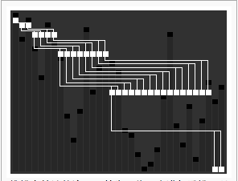
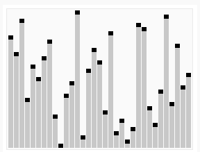
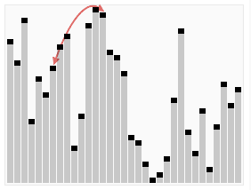
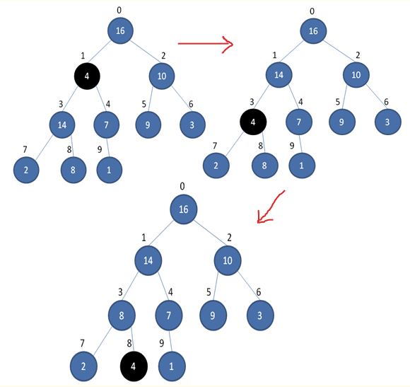
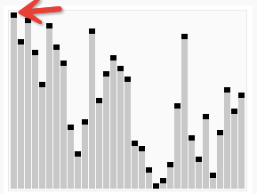
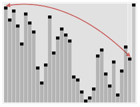
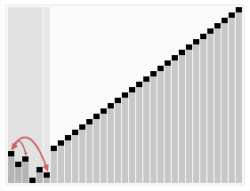

## Lesson 38 - 堆排序问题

### 课程任务
堆是一个近似完全二叉树的结构，并同时满足堆的性质：即子结点的键值或索引总是小于（或者大于）它的父节点。

**如果一个堆的根节点是大值，则称为最大堆。**

堆排序算法的基本思想是，将数组A创建为一个最大堆，然后交换堆的根(最大元素)和最后一个叶节点x，将x从堆中去掉形成新的堆A1，然后重复以上动作，直到堆中只有一个节点。

通常堆是通过一维数组来实现的。在起始数组下标为 0 的情形中：

* 父节点i的左子节点在位置 (2*i+1);
* 父节点i的右子节点在位置 (2*i+2);

#### 堆、二叉树和数组下标的对应关系

#### 堆排序算法
* 数组的起始状态（随机排列）  

* **单一末端子节点的最大堆调整（Max_Heapify）**   

如下图所示，将堆的任一子节点 A（4）作调整，使得以A为根节点的树，所有子节点永远小于父节点。

这个调整需要用到递归，较小的子节点会（4）逐级下降。

**算法需要确保在对 A（4） 做调整时，A 的左子树 14 和右子树 7 都分别已经是最大堆了。这是由子节点做调整的先后顺序来确保的。**

* **建立最大堆树（Build_Max_Heap）**
	- 将堆所有子节点数据按照从最底层向最上层的顺序，进行最大堆调整（Max_Heapify），重新排序后建立最大堆树。（这样根节点就是最大值）

* 交换根节点（最大值）和数组最后那个位置的元素，然后对 size-1 的树重新进行“建立最大堆树”  

* 重复以上动作，直到堆中只有一个节点，算法结束  

### 参考资料
* 堆排序 <http://zh.wikipedia.org/wiki/堆排序>
* 经典排序算法 - 堆排序Heap sort <http://www.cnblogs.com/kkun/archive/2011/11/23/2260286.html>

