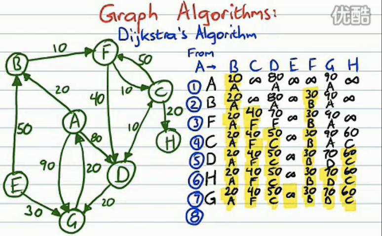

## Lesson 46 - Dijkstra 算法

### 课程任务
对下面的有向图，求出从A出发到任一其他点的最短路径。

算法要点：
* 首先将各点的已知最短距离设为无穷大，前驱点都未知
* 从起点开始拓展边(u,v) 如果d[v] > d[u] + w(u,v) 则更新d[v]
* 更新d[v]的同时，记录v的前驱点，以便未来能够回溯出最短路径
* 起点所在的集合为S，保留我们已知d[v]的值是最短路径的顶点集合
* 其他所有点的集合为Q，每次遍历都有一个顶点从Q移动到S，这个被选择的顶点是Q中拥有最小的d[u]值的顶点

### 图论编程
* 点集合用一维字符数组表示，数组元素为点的名称
* 边集合用二维整型数组表示，数组元素为边的长度
* 有向图用横坐标和纵坐标表示，横坐标为起点，纵坐标为终点
* 最佳路径的轨迹，只需记录该路径上每个点的前趋，前驱点也是用一维数组表示

### 参考资料
* 迪科斯彻算法 <http://zh.wikipedia.org/wiki/迪科斯彻算法>
* 迪科斯彻算法（Dijkstra）[视频演示](http://v.youku.com/v_show/id_XMjQyOTY1NDQw.html)
