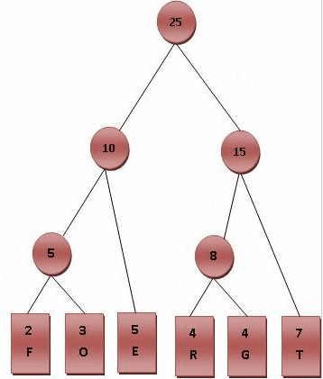
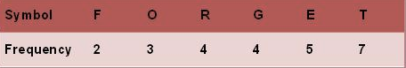

## Lesson 47 - Huffman Coding 算法

### 课程任务
霍夫曼树又称最优二叉树，是一种带权路径长度最短的二叉树。所谓树的带权路径长度，就是树中所有的叶结点的权值乘上其到根结点的路径长度，树的路径长度是从树根到每一结点的路径长度之和

霍夫曼编码（Huffman Coding）是一种编码方式，是一种用于无损数据压缩的熵编码（权编码）算法。

请对 [Lesson 37](Lesson-37.md) 所统计的文本中出现的英文字母，进行霍夫曼编码，并对比使用算法后的文本大小压缩比。

算法要点：
* 将每个英文字母依照出现频率由小排到大
* 将最小的两个字母频率相加合成一个新的节点
* 比较新节点和其他节点，仍然找出频率最小的2个点合并
* 重复上面2个步骤，直到没有可以比较的对象
* 最后产生的树状图就是霍夫曼树

### 参考资料
* 霍夫曼编码算法 <http://zh.wikipedia.org/wiki/霍夫曼编码>
* 哈夫曼编码的C语言实现 <http://www.cnblogs.com/syblogs/articles/2020145.html>
* Huffman 编码压缩算法 <http://coolshell.cn/articles/7459.html>
