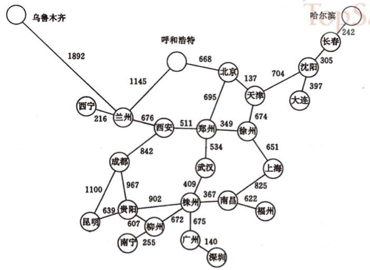

## Lesson 48 - 地图导航项目

### 课程任务
* 请根据下图的信息，使用 ncurses 库绘制出一张中国城市地图
* 实现一个地图导航应用，可以添加和删除新的城市和路线信息
* 提供用户输入界面，可以计算出任意两个城市之间的最短路径。

### 重要知识点
* ncurses 库的使用
	- http://www.paulgriffiths.net/program/c/
	- http://invisible-island.net/ncurses/ncurses-intro.html

### 参考资料
* 用弗洛伊德最短路径实现任意两个城市之间的最短距离 <http://hi.baidu.com/wangjinhe7/item/f8834e2dad4cb88eaf48f5ee>
